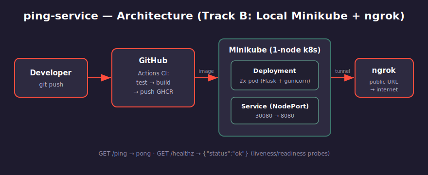

# ping-service

A tiny HTTP service, packaged with Docker, built via GitHub Actions, deployed to a
single-node **minikube** cluster, and exposed to the internet with **ngrok**.

Built for the Insider One DevOps internship case. **Track B — Local Minikube + ngrok.**

```
GET /ping     -> pong
GET /healthz  -> {"status": "ok"}
```

---

## Architecture



```
Developer --git push--> GitHub Actions (test -> docker build -> push GHCR)
                                 |
                                 v
                  Minikube (1-node Kubernetes)
                  Deployment (2 pods) + Service (NodePort 30080)
                                 |
                              ngrok tunnel
                                 |
                            public internet
```

The app is a small Flask service served by gunicorn. It runs as 2 replicas behind a
NodePort Service. `/healthz` backs the Kubernetes liveness & readiness probes. ngrok
opens a public URL to the local cluster — no cloud account required.

---

## Project layout

```
ping-service/
├── app/
│   ├── main.py          # Flask app: /ping, /healthz, /
│   └── test_main.py     # pytest tests (run in CI)
├── k8s/
│   ├── deployment.yaml  # 2 replicas + probes + resource limits
│   └── service.yaml     # NodePort 30080 -> 8080
├── .github/workflows/
│   └── ci.yml           # test -> docker build -> push to GHCR
├── docs/
│   └── architecture.svg
├── Dockerfile           # multi-stage, non-root
├── requirements.txt
├── .gitignore
├── .env.example
└── README.md
```

---

## 1. Run locally (no Docker)

```bash
pip install -r requirements.txt
python app/main.py
# in another terminal:
curl http://localhost:8080/ping      # -> pong
curl http://localhost:8080/healthz   # -> {"status":"ok"}
```

Run the tests:

```bash
python -m pytest app/ -v
```

---

## 2. Build & run with Docker

```bash
docker build -t ping-service:latest .
docker run -p 8080:8080 ping-service:latest
curl http://localhost:8080/ping      # -> pong
```

---

## 3. Deploy to minikube

Start the cluster (Docker driver):

```bash
minikube start --driver=docker
```

Build the image **directly into minikube's docker daemon** so the cluster can use it
without a registry:

```bash
minikube image build -t ping-service:latest .
```

Apply the manifests:

```bash
kubectl apply -f k8s/deployment.yaml
kubectl apply -f k8s/service.yaml
kubectl get pods          # wait until both are Running
```

Test it through the Service:

```bash
minikube service ping-service --url
# open the printed URL + /ping in a browser, or:
curl "$(minikube service ping-service --url)/ping"   # -> pong
```

---

## 4. Expose to the internet with ngrok

First, one-time auth (free ngrok account — copy your token from the ngrok dashboard):

```bash
ngrok config add-authtoken <YOUR_TOKEN>
```

Get the local service URL and tunnel it:

```bash
minikube service ping-service --url
# example output: http://127.0.0.1:54321
ngrok http 54321
```

ngrok prints a public `https://....ngrok-free.app` URL. Append `/ping`:

```
https://<random>.ngrok-free.app/ping   -> pong
```

That public URL is the deliverable demo link.

---

## 5. CI pipeline

`.github/workflows/ci.yml` runs on every push/PR to `main`:

1. **test** — install deps, run pytest.
2. **docker** — (only if tests pass) build the image and push it to GHCR as
   `ghcr.io/<owner>/<repo>:latest`.

Uses the built-in `GITHUB_TOKEN`, so no extra secrets are needed.

---

## Environment variables

| Variable | Default | Description          |
|----------|---------|----------------------|
| `PORT`   | `8080`  | Port the app listens on |

Copy `.env.example` to `.env` for local overrides. **`.env` is gitignored — never commit real secrets.**

---

## Branching plan

- `main` — always deployable.
- `feature/*` — one branch per change, merged into `main` via PR (CI must pass).

---

## Decisions log

1. **Python + Flask + gunicorn** — fastest to write a correct `/ping`; gunicorn instead
   of Flask's dev server so the container behaves like production.
2. **Track B (local minikube + ngrok)** — zero cloud cost and ~15 min setup; the case
   scores both tracks equally, so I optimized for a reliable, reproducible demo.
3. **Multi-stage, non-root Dockerfile** — smaller final image and no root inside the
   container (least privilege).
4. **NodePort Service** — simplest way to reach the app on a single-node cluster; ngrok
   then tunnels that port to the internet (no Ingress needed for one service).
5. **Probes on `/healthz`** — lets Kubernetes restart unhealthy pods and hold traffic
   until a pod is ready; cheap reliability win.
